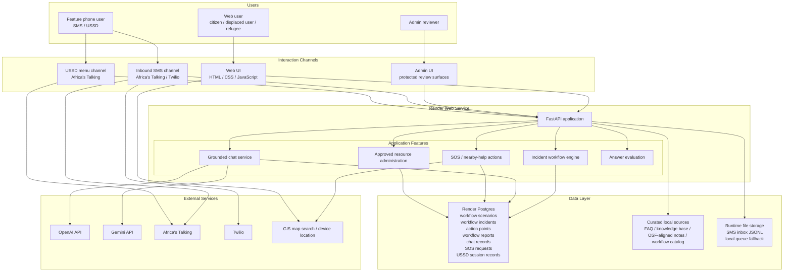

# Civic Access Navigator for Open Society Foundations — Architecture Diagram

This file is the submission-ready architecture diagram for the current capstone implementation.

## System Diagram

## Component Notes

- **Web UI** is the primary rich interface for multilingual workflow selection, structured reporting, chat, SOS, and nearby-help actions.
- **SMS** provides low-connectivity free-text intake for urgent peace and accountability questions.
- **USSD** provides a guided feature-phone flow for start-report, follow-up, rights-help, and emergency handling.
- **FastAPI** is the central application layer that serves the frontend, admin pages, JSON APIs, and telco callback routes.
- **Postgres** is the main system of record for workflow, reporting, chat, SOS, and USSD session data.
- **Curated local sources** ground the bot and workflow logic in approved internal material before optional public-model synthesis.
- **OpenAI / Gemini** are optional synthesis layers, not the authoritative source base.
- **Africa's Talking / Twilio** act as delivery gateways for low-connectivity channels.

## Submission Summary

The architecture is intentionally multi-channel:

1. **Web** for richer interaction and review
2. **SMS** for low-bandwidth free-text outreach
3. **USSD** for structured guided interaction on basic phones
4. **Admin** for protected oversight and verification

This supports the capstone goal of lowering the cost and risk of civic participation in fragile environments while preserving grounded accountability workflows.
